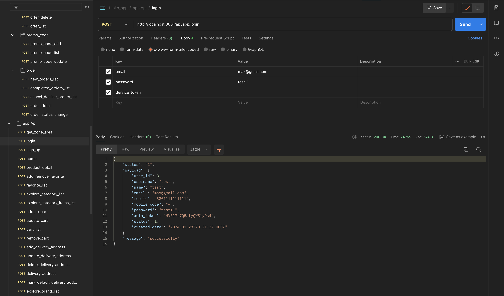
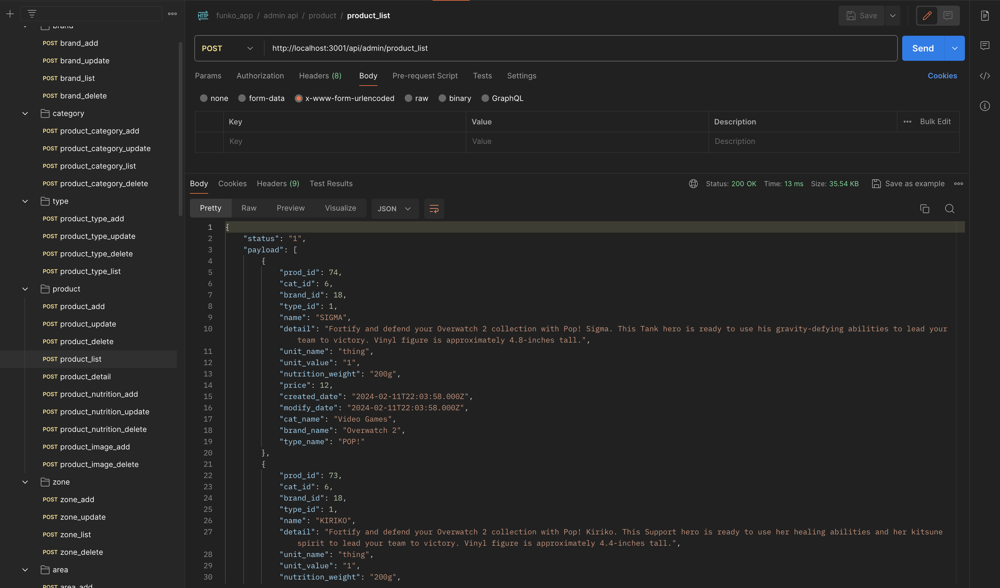

  <h1 align="center">Funko Online Store</h1>

 

Funko Online Store is a program that allows the user to make online purchases.

## Technologies

- **Swift** The programming language used in the development of the application, the MVVM design pattern is used
- **MySQL** used for modeling the database
- **JS** the programming language in which the backend of the program component was developed
- **Postman** used for API calling

## Demo 

  
  <h1 align="center">Login View</h1>
  

  <h1 align="center">Home View, Product Dateil</h1>
  

  <h1 align="center">Explore View</h1>
  

  <h1 align="center">Cart View</h1>
  

  <h1 align="center">Favorite View</h1>
  

  <h1 align="center">Profile View: My Orders</h1>
  

  <h1 align="center">Profile View: My Details</h1>
  

  <h1 align="center">Profile View: Delivery Address</h1>
  

  <h1 align="center">Profile View: Payment Methods</h1>
  

  <h1 align="center">Profile View: Promo Code, Notifications, Info</h1>
  

## Tech Stack

- [Xcode](https://developer.apple.com/xcode/) – Apple's integrated development environment (IDE)
- [Swift](https://developer.apple.com/swift/) – programing language
- [MySQL](https://www.mysql.com) – open-source relational database management system (RDBMS)
- [Postman](https://www.postman.com) - API platform for building and using APIs
- [JS] - programing language

## Database

 
  <h1 align="center">General view of the database</h1>
  

  <h1 align="center">A table in which the data of all registered users is stored</h1>
  

## for example - Postman API Calling

 
  
  <h1 align="center">API Call: login</h1>
  

  <h1 align="center">API Call: product_list</h1>
  

## Thank you for watching!

## You can see me on [linkedin](https://www.linkedin.com/in/maksym-kokhaniuk-1a0872287/)

